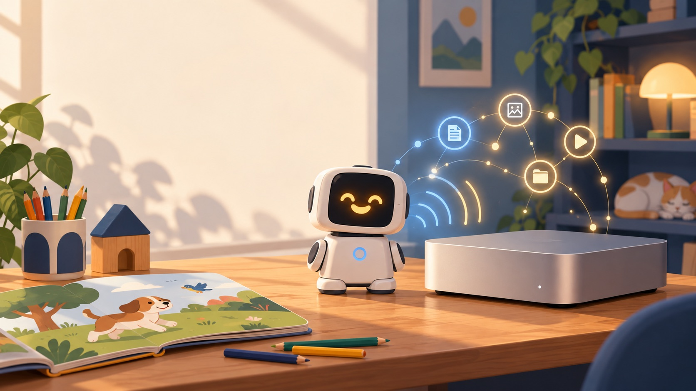
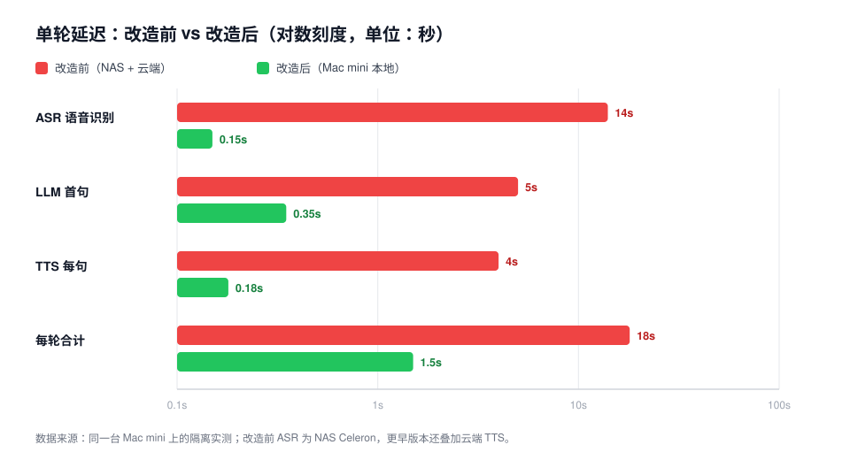
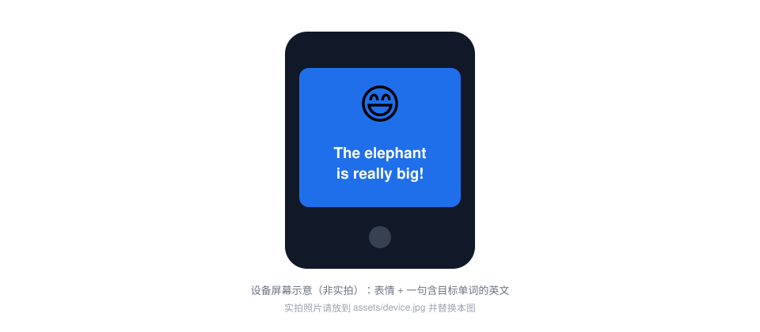
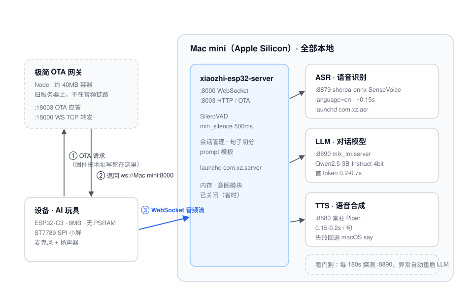
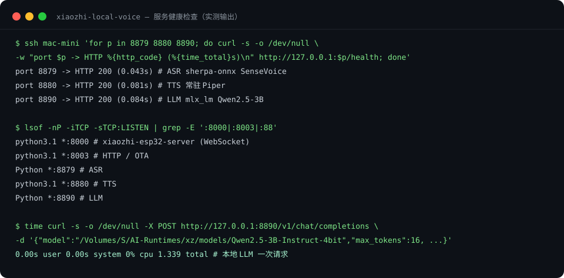

# xiaozhi-local-voice

**把 AI 玩具的语音链路整个搬回家里：15—20 秒的等待，压到 1—2 秒。**

[](LICENSE)
[](#部署)
[](#实测收益)
[](#支持这个项目)
[](https://github.com/xinnan-tech/xiaozhi-esp32-server)

> Turn a slow cloud-based AI companion toy into a **fully local, 1–2 second** voice loop on a single Apple Silicon Mac — ASR, LLM and TTS all on-device, no paid API. Built for kids practising spoken English, where "fast enough to feel like a conversation" is the whole product.



## 这是在解决什么问题

几十块到一两百块的 AI 玩具机器人（xiao-zhi / xiaozhi-esp32 生态）大多是这样的默认配置：语音识别跑在一台低功耗 NAS 上，回复走局域网里共享的大模型服务，语音合成调用云端 TTS。

每一环单独看都能work，拼在一起的结果是：孩子说完一句话，要等 **15—20 秒**才听到回应。对一个五六岁的孩子来说，这个等待时间已经足够让他转身走开。

这个项目做的事很具体：**把整条语音链路搬到一台 Apple Silicon Mac 上，让每一段都只剩几十到几百毫秒。** 不换更贵的硬件，不换更大的模型，只是把每一环放到算力匹配的地方，并把几个隐藏的固定开销去掉。

## 实测收益



| 环节 | 改造前 | 改造后 |
|---|---|---|
| ASR 语音识别 | 10—18 s（NAS 双核 Celeron） | **~0.15 s** |
| LLM 首句 | 3—15 s（共享大模型 + 未关思考） | **0.3—1 s** |
| TTS 语音合成 | 3—5 s/句 × 3 句（云端） | **0.15—0.2 s/句** |
| **每轮合计** | **15—20 s** | **1—2 s** |

几个反直觉的实测结论：

- **慢的不是大模型，是 ASR 跑错了机器。** 同一个 SenseVoice 小模型，在 NAS 上要 10.7 秒，在 M4 上只要 0.05—0.19 秒——差约 100 倍。模型不用换，换算力就够。
- **换更小的 LLM 不会更快。** M4 本地 Qwen3-8B 要 2.5—3.4 秒，反而慢于共享的 GLM-5.3-Flash（1.7—2.9 秒）。真正拖时间的是「没关思考模式」和「每轮重新计算 6000 多字符的系统提示词」。
- **TTS 音质和速度是两笔账。** 常驻 Piper 每句 0.15—0.2 秒，macOS `say` 约 0.7 秒，Kokoro 音质最好但要 1.1—2.3 秒。对话场景里，快比好听更重要。

## 孩子在用的时候是什么样


屏幕是这块板子唯一的「输出面」。固件只提供三个显示通道：情绪表情、孩子的原话（STT）、机器人的回复（TTS）。所以我们把提示词改成：**每次回复 = 1 个情绪表情 + 1 句不超过 10 个词、且必须包含当前目标单词的英文短句**。

于是屏幕上会同时出现：一张笑脸、一句 "The elephant is really big!"，以及孩子刚刚说的那句话。



*上图为屏幕布局示意；Emoji 由服务端在送 TTS 前剥离，只走显示通道，不会影响朗读内容，也不会拖慢速度。*

## 架构



- **服务端**用上游 [`xinnan-tech/xiaozhi-esp32-server`](https://github.com/xinnan-tech/xiaozhi-esp32-server)，本仓库只提供配置与补丁，不复制厂商源码。
- **ASR / LLM / TTS** 三个服务用 OpenAI 兼容协议暴露，全部由 launchd 常驻在同一台 Mac 上。
- **OTA 网关**：这类白牌设备的固件把服务器地址写死在板子里，所以旧服务器上必须留一个极简 OTA 应答把设备引到新主机。它约 40MB，不在音频链路上。

## 部署

```bash
git clone https://github.com/Jenpo/xiaozhi-local-voice
cd xiaozhi-local-voice

# 1) 安装上游服务端（建议放在外接卷，例如 /Volumes/S/AI-Runtimes/xz/server）
git clone https://github.com/xinnan-tech/xiaozhi-esp32-server

# 2) 准备模型（体积大，不进仓库）
#    SenseVoice / Qwen2.5-3B-Instruct-4bit (MLX) / Piper en_US-amy-medium / SileroVAD

# 3) 写配置
cp server/data/.config.example.yaml server/data/.config.yaml
#   填：本机局域网 IP、设备 MAC、自己生成的 ASR/TTS token

# 4) 加载常驻服务
for f in services/launchd/com.xz.*.plist; do cp "$f" ~/Library/LaunchAgents/; done
launchctl bootstrap gui/$(id -u) ~/Library/LaunchAgents/com.xz.server.plist
#   asr / tts / llm / watchdog 同理

# 5) 旧服务器上跑 OTA 网关（或用 Docker）
docker run -d --name xz-ota -p 18000:18000 -p 18003:18003 \
  -e XZ_PUBLIC_HOST=<旧服务器IP> -e XZ_UPSTREAM=<Mac mini IP>:8000 \
  -v $PWD/gateway:/app -w /app node:22-alpine node gateway.js
```

改完断电重启机器人一次，它会重新拉 OTA 并直连新主机。

## 实测证据



三个服务健康检查全 200，延迟分别是 0.043s / 0.081s / 0.084s；本地 LLM 一次完整请求约 1.3 秒。这些数字可以在你自己的机器上一条命令复现：

```bash
for p in 8879 8880 8890; do
  curl -s -o /dev/null -w "port $p -> %{http_code} (%{time_total}s)\n" http://127.0.0.1:$p/health
done
```

## 踩过的坑（都写进排查表了）

| 症状 | 真正原因 |
|---|---|
| 显示「连接中」/「我们稍后再试吧」 | 大概率不是网络，而是本地 LLM 服务跑两小时后漂移（单核 100%、返回 502）。已用每 180 秒探测一次、异常自动重启的看门狗兜住 |
| `curl` 返回 200，应用却报 502 | Mac 的系统代理被 httpx / openai SDK 读取，连 `127.0.0.1` 也被送去代理。给服务进程加 `NO_PROXY` |
| launchd 启动即 exit 78 | launchd 不能把日志写到外接卷，改用外接卷上的启动脚本重定向 |
| mlx_lm.server 启动时去 HuggingFace 拉模型 | `model_name` 必须写本地路径，不能写 repo id |
| 精简提示词后屏幕不显示表情 | emoji 指令被一起删掉了，自定义 prompt 要补回白名单前缀 |

## 硬件上的现实边界

测试用的是一块白牌 `zuowei-c3-lcd` 板：ESP32-C3、8MB flash、**没有 PSRAM**、ST7789 SPI 小屏，固件是上游官方固件二次编译。

结论很明确：**这块板只能显示静态 emoji + 文本，跑不动官方的 EmoteDisplay 动画。** 想要会动的眼睛和表情，需要换官方支持的 ESP32-S3 带屏板（N16R8，带 PSRAM），然后改一下配置里的设备 MAC 就能接入同一台服务器。

这也是这个项目想说明的一件事：**硬件天花板和软件优化是两笔账，先分清楚再动手。**

## 它能带来什么

**对家长和孩子**：一台一两百块的玩具，经过这套本地化改造，从「孩子说一句等十几秒」变成「像对话一样接得上」。语音数据不出家门，不按次付费，断网也能用。

**对做同类硬件的人**：把「慢」这件事拆成了可测量的四段（VAD / ASR / LLM / TTS），并给出了每段的实测基线。多数情况下你要动的不是模型，而是部署位置。

**对开源的 xiaozhi 生态**：服务端、固件、资源生成器都是 MIT 且活跃，但「怎么把它跑得快」这件事缺一份可复现的实测记录。这份仓库补的是这一块——包括所有失败路径和回滚方法。

## 常见问题

**必须用 Mac mini 吗？**
不必须，但需要算力够。关键是让 ASR 离开低功耗 NAS；任何算力正常的 x86/ARM 主机（有 GPU 更好）都会明显更快。

**一定要买新硬件吗？**
不需要。项目本身的收益来自软件侧：换算力位置 + 关思考 + 精简提示词 + 常驻 TTS + 调 VAD。只有想要「动画表情」才需要换带 PSRAM 的板子。

**会不会按量付费？**
这条链路没有云 API 费用：ASR、LLM、TTS 全在本机，离线可用。

**最小改动能拿到多少收益？**
如果只想动一件事：把 ASR 从 NAS 挪到算力够的机器。这一项通常就占了整轮延迟的一大半。

## 路线图

- [ ] 出一键安装脚本（模型下载 + plist 模板生成）
- [ ] 补 `assets/device.jpg` 实机照片与一段对话录像
- [ ] 增加 Linux（含 CUDA）部署路径
- [ ] 把看门狗从「探测延迟」升级为「探测漂移趋势」

## 支持这个项目

这个仓库是免费、开源的。如果它帮你把一台吃灰的 AI 玩具救活了，或者省下了你几天排查时间，可以在 GitHub Sponsors 上支持后续维护：

**👉 [github.com/sponsors/Jenpo](https://github.com/sponsors/Jenpo)**

赞助会用在：新硬件的验证（例如 ESP32-S3 带屏板做动画表情）、回归测试、以及把部署流程做成一键脚本。

不方便赞助也没关系，这些同样有价值：

- ⭐ Star 这个仓库，让更多被「AI 玩具太慢」困住的人搜到它
- 🐛 提 Issue 报告你遇到的设备型号和复现步骤（尤其是别的厂商白牌板）
- 💡 分享你机器上的实测数字，帮我们补齐不同硬件的基线
- 🛠️ 提交 PR：Linux/CUDA 部署路径、更多 TTS 引擎、一键安装脚本都欢迎

## 许可

MIT。服务端来自 [`xinnan-tech/xiaozhi-esp32-server`](https://github.com/xinnan-tech/xiaozhi-esp32-server)（MIT），固件来自 [`78/xiaozhi-esp32`](https://github.com/78/xiaozhi-esp32)（MIT）。本仓库只包含配置、补丁与我们自己写的服务脚本。
